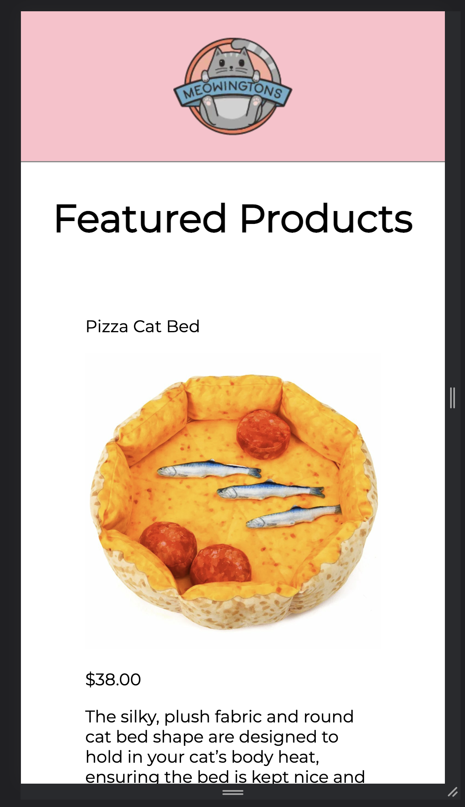
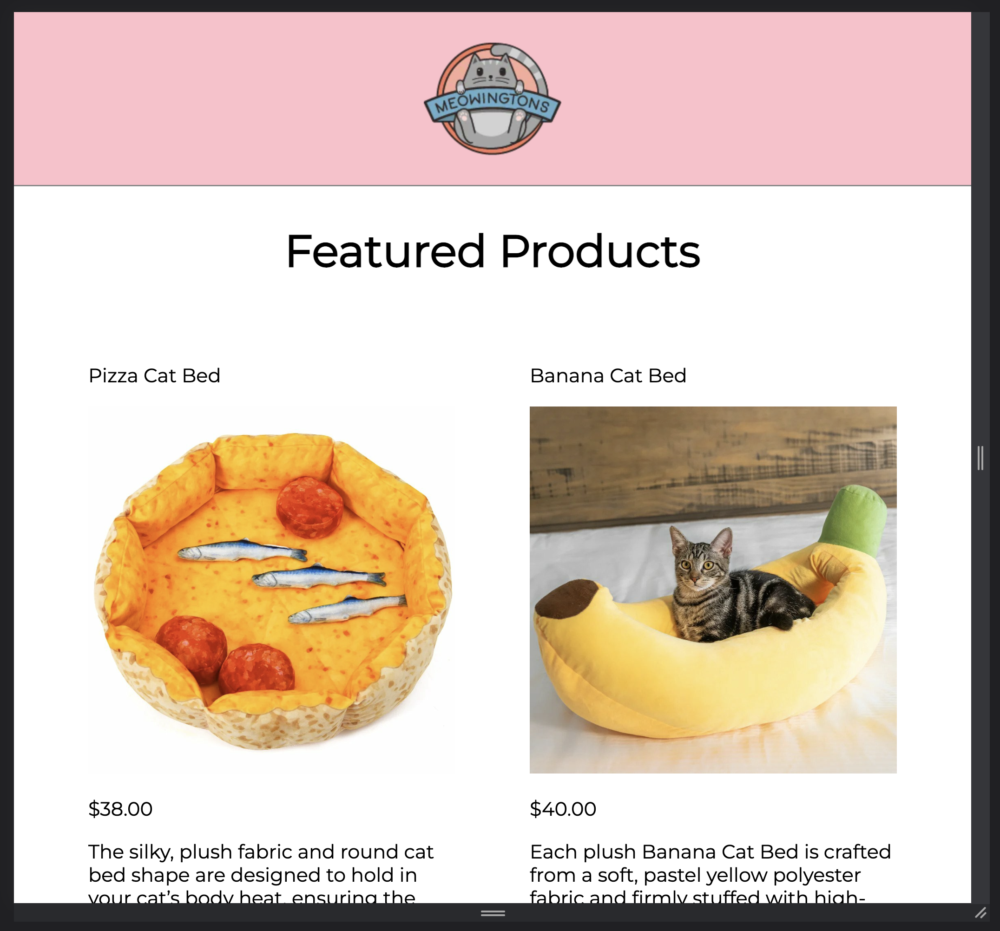
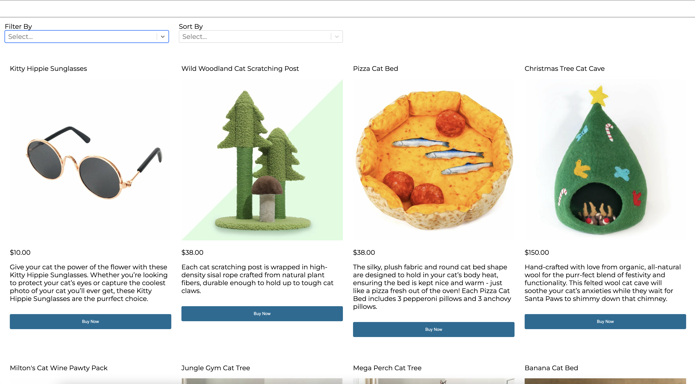

## Meowingtons Cat Supplies

#### Description:

A one page shopping site for cat products.

## Project Screen Shots

The page is reactive for three perspectives, mobile, tablet, and desktop

#### Example:





## Installation and Setup Instructions

#### Local Setup

Clone down this repository. You will need `node` and `npm` installed globally on your machine.

Installation:

`npm install`

To Run Test Suite:

`npm test`

To Start Server:

`npm start`

To Visit App:

`localhost:3000`

#### Services

Links to the deployed applications:
Render:

https://online-react-catstore.onrender.com

Begin:

Production:
https://invent-tvd.begin.app
Staging:
https://invent-tvd-staging.begin.app

To run on your own, update .env to look like this:

```
REACT_APP_API_URL={{ your begin url here }}
REACT_APP_STRIPE_PUBLIC_KEY={{ public stripe api key }}
```
